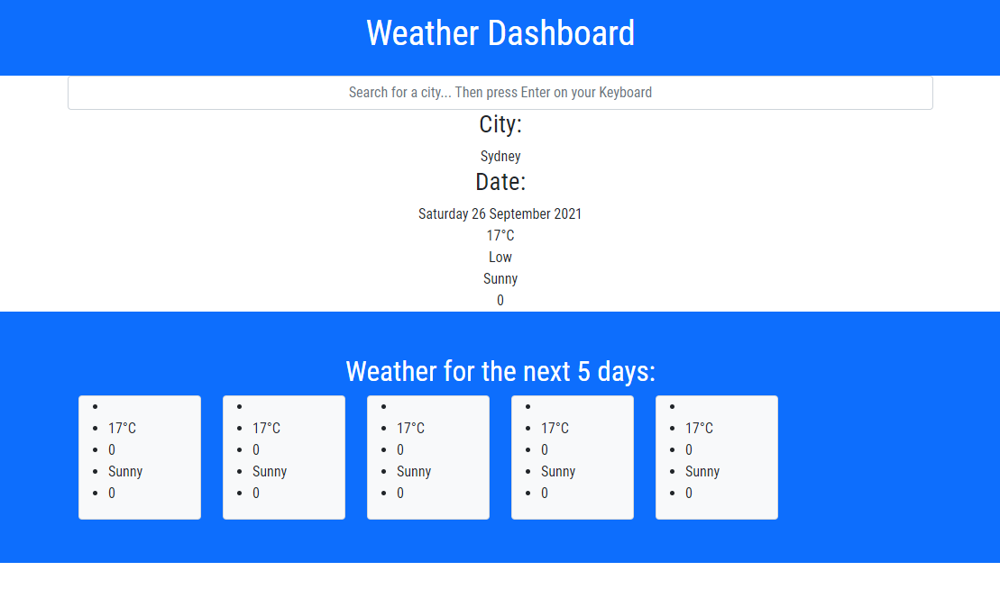

# 06-hw-weather-dash
Weather Dashboard Application

## User Story

```
AS A traveler
I WANT to see the weather outlook for multiple cities
SO THAT I can plan a trip accordingly
```

## Acceptance Criteria

```
GIVEN a weather dashboard with form inputs
WHEN I search for a city
THEN I am presented with current and future conditions for that city and that city is added to the search history
WHEN I view current weather conditions for that city
THEN I am presented with the city name, the date, an icon representation of weather conditions, the temperature, the humidity, the wind speed, and the UV index
WHEN I view the UV index
THEN I am presented with a color that indicates whether the conditions are favorable, moderate, or severe
WHEN I view future weather conditions for that city
THEN I am presented with a 5-day forecast that displays the date, an icon representation of weather conditions, the temperature, the wind speed, and the humidity
WHEN I click on a city in the search history
THEN I am again presented with current and future conditions for that city
```

## Tasks Completed 

- Created HTML Structure page
- Added Bootstrap CDN
- Added Font-awesome CDN
- Added Moment CDN
- Linked JS file and CSS files
- Created JS file and created variables
- - Fetched API
- - Got current day using Moment.JS
- - Created function for day results
- - Created function for 5 day results
- - Inside functions added data from API
- - Inside functions added images depending on API Data for weather that day.
- - Linked search box to API

## Demo




## Links

### REPO

### PAGE

